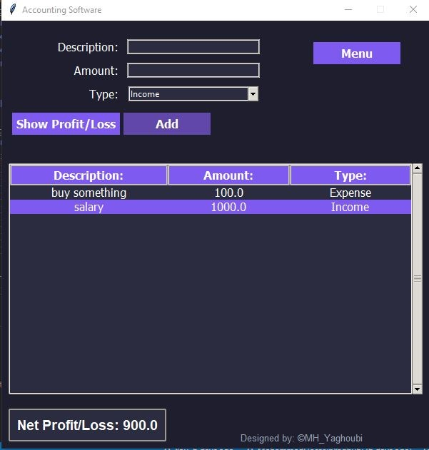
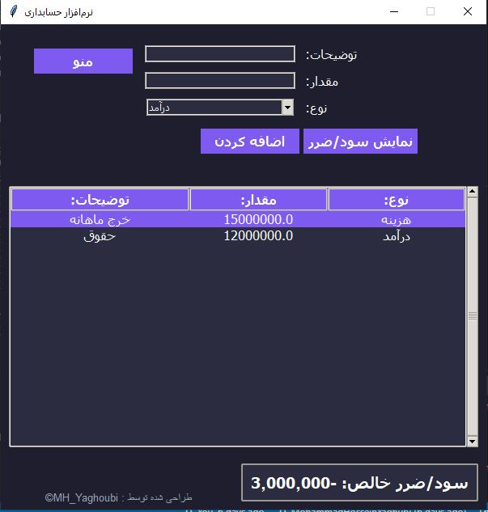

# Accounting Software

## Software Demo
You can view the the demo of this software here: [Accounting Software video clip](https://drive.google.com/file/d/1sLsq0l-jz90Fw_DpwsOGy_QO4pbrKCPO/view?usp=drivesdk)

A bilingual (English/Persian) desktop accounting application with a modern dark theme GUI for managing income and expenses.

## Features

- 💰 **Transaction Management**: Add, edit, and delete income/expense records
- 🌐 **Bilingual Interface**: Switch between English and Persian seamlessly
- 📊 **Profit/Loss Calculation**: Automatic net profit/loss computation
- 💾 **Data Persistence**: Save and load transactions to/from JSON file
- 🎨 **Modern UI**: Dark theme with responsive design
- 📱 **Responsive Layout**: Adapts to RTL/LTR languages

## Screenshots

### Prerequisites
- Python 3.6+
- Tkinter (usually comes with Python)

## Support This Project
If you found this project helpful or enjoyed using it, we would greatly appreciate your support! Giving a ⭐️ star on GitHub not only motivates us but also helps others discover this project. Thank you for your kindness and encouragement!
